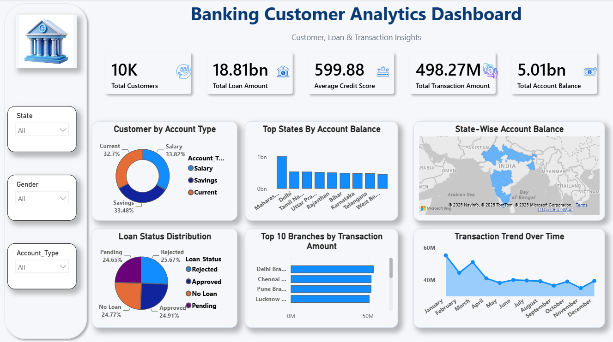

# 🏦 Banking Power BI Dashboard

An interactive *Banking Analytics Dashboard* built using *Microsoft Power BI* to analyze customer data, banking performance, and key business metrics through dynamic visualizations and actionable insights.

---

## 📌 Project Overview

This dashboard transforms raw banking data into meaningful insights using Power BI. It helps analyze customer demographics, account performance, transaction trends, and important KPIs through interactive charts and filters.

---

## 🎯 Objectives

- Analyze banking data effectively.
- Monitor important business KPIs.
- Understand customer behavior and trends.
- Build an interactive and user-friendly dashboard.
- Support data-driven business decisions.

---

## 📊 Dashboard Features

- 📈 KPI Cards
- 📊 Interactive Charts
- 👥 Customer Analysis
- 💳 Account Performance
- 🎛️ Interactive Filters & Slicers
- 📉 Business Trend Analysis
- 🎨 Clean & Professional Dashboard Design

---

## 🛠️ Tools & Technologies

- Microsoft Power BI
- Microsoft Excel
- Power Query
- DAX
- Data Cleaning
- Data Visualization

---

## 📂 Repository Structure

📁 Banking-PowerBI-Dashboard
│── Banking_Dashboard.pbix
│── Banking_Dataset.xlsx
│── Banking_Dashboard_page1.png
│── README.md

---

## 📈 Key Insights

- Customer distribution analysis
- Banking performance monitoring
- Interactive KPI tracking
- Financial trend analysis
- Business performance visualization

---

## 🚀 How to Use

1. Download this repository.
2. Open Banking_Dashboard.pbix in *Power BI Desktop*.
3. Load the dataset if required.
4. Explore the interactive dashboard.

---

## 📷 Dashboard Preview

---

## 👨‍💻 Author

*Abhishek Jha*

*B.Tech (Computer Science & Engineering)*

*Aspiring Data Analyst | Power BI | SQL | Python*

---

## ⭐ Support

If you found this project useful, please consider giving it a *Star ⭐* on GitHub.
